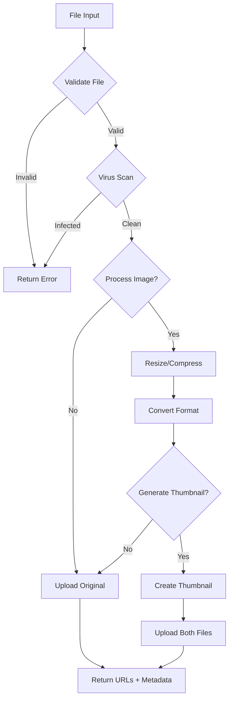

# MinIO File Storage System - Tài liệu đầy đủ

## 📋 Tổng quan

Hệ thống quản lý file MinIO cho Discord clone với khả năng:
- ✅ Upload/Download file đa dạng (ảnh, video, audio, document, PDF)
- ✅ Xử lý và tối ưu ảnh tự động (resize, compress, convert format)
- ✅ Upload file lớn với chunked upload (multipart)
- ✅ Presigned URLs cho client upload trực tiếp
- ✅ Bảo mật: rate limiting, virus scan, file validation
- ✅ Generate thumbnails tự động
- ✅ Metadata tracking

---

## 🗂️ Cấu trúc thư mục

```
lib/minio/
├── client.ts              # Core MinIO operations
├── file-processing.ts     # Image processing, validation
├── security.ts           # Security, rate limiting
└── README.md             # Documentation (file này)
```

---

## 🔧 Cấu hình môi trường

```env
# MinIO Configuration
MINIO_ENDPOINT=localhost:9000
MINIO_USE_SSL=false
MINIO_ACCESS_KEY=minioadmin
MINIO_SECRET_KEY=minioadmin123
MINIO_BUCKET_NAME=discord-files
NEXT_PUBLIC_UPLOAD_ENDPOINT=http://localhost:9000/discord-files
```

---

## 📦 Dependencies

```json
{
  "minio": "^8.0.0",      // MinIO client
  "sharp": "^0.33.0"      // Image processing
}
```

---

## 🎯 Các chức năng chính

### 1. Upload File đơn giản

**Function**: `uploadFile()`

```typescript
import { uploadFile } from '@/lib/minio/client';

const fileUrl = await uploadFile(
  buffer,           // Buffer data
  'image.jpg',      // Filename
  'discord-files'   // Bucket name (optional)
);

// Returns: "http://localhost:9000/discord-files/image.jpg"
```

**Cơ chế hoạt động**:
1. Kiểm tra bucket có tồn tại (tạo nếu chưa có)
2. Upload buffer lên MinIO
3. Trả về public URL

---

### 2. Upload File nâng cao với validation

**Function**: `uploadFileAdvanced()`

```typescript
import { uploadFileAdvanced } from '@/lib/minio/client';

const result = await uploadFileAdvanced(file, fileName, {
  validation: {
    maxSize: 10 * 1024 * 1024,              // 10MB
    allowedTypes: ['image/jpeg', 'image/png'],
    allowedExtensions: ['jpg', 'jpeg', 'png'],
    maxWidth: 4000,
    maxHeight: 4000
  },
  processImage: true,                        // Tự động xử lý ảnh
  imageOptions: {
    maxWidth: 1920,
    maxHeight: 1080,
    quality: 85,
    format: 'webp'                           // Convert sang WebP
  },
  virusScan: true,                           // Scan virus
  generateThumbnail: true,                   // Tạo thumbnail
  metadata: {
    userId: '123',
    channelId: 'abc'
  }
});

// Returns:
{
  success: true,
  fileUrl: "http://localhost:9000/discord-files/image.webp",
  thumbnailUrl: "http://localhost:9000/discord-files/thumbnails/image-thumb.webp",
  metadata: {
    fileName: "processed-1234567890.webp",
    originalName: "photo.jpg",
    size: 245632,
    contentType: "image/webp",
    uploadTime: "2025-11-12T10:30:00.000Z",
    width: 1920,
    height: 1080,
    format: "webp"
  }
}
```

**Cơ chế hoạt động**:



**Xử lý từng loại file**:

#### 📷 Ảnh (JPEG, PNG, GIF, WebP)
- **Validation**: Kiểm tra kích thước, định dạng
- **Processing**: 
  - Resize nếu vượt quá maxWidth/maxHeight
  - Compress với quality setting
  - Convert sang WebP (tối ưu 30-40% dung lượng)
  - Extract metadata (width, height, format)
- **Thumbnail**: Tạo thumbnail 200x200px, format WebP, quality 70%

#### 📄 PDF
- **Validation**: Kiểm tra magic number `%PDF`
- **Processing**: Upload trực tiếp (không xử lý)
- **Security**: Scan virus, check file size

#### 🎥 Video (MP4, MOV, AVI, MKV, WebM)
- **Validation**: Kiểm tra magic bytes (ftyp header)
- **Processing**: Upload trực tiếp
- **Note**: Không xử lý video (tốn tài nguyên)

#### 🎵 Audio (MP3, WAV, OGG, FLAC, M4A)
- **Validation**: Kiểm tra file extension
- **Processing**: Upload trực tiếp
- **Metadata**: Store trong MinIO metadata

#### 📝 Documents (DOC, DOCX, TXT, RTF)
- **Validation**: Check extension và content-type
- **Processing**: Upload as-is
- **Security**: Virus scan bắt buộc

---

### 3. Presigned URLs - Client upload trực tiếp

**Use case**: Upload file lớn mà không qua server (tiết kiệm bandwidth)

```typescript
// SERVER: Generate presigned URL
import { getPresignedUploadUrl } from '@/lib/minio/client';

const uploadUrl = await getPresignedUploadUrl(
  'file.jpg',
  'discord-files',
  3600  // URL valid trong 1 giờ
);

// CLIENT: Upload trực tiếp
const response = await fetch(uploadUrl, {
  method: 'PUT',
  body: fileBuffer,
  headers: {
    'Content-Type': 'image/jpeg'
  }
});
```

**Flow diagram**:

```
┌──────────┐         ┌──────────┐         ┌──────────┐
│  Client  │         │  Server  │         │  MinIO   │
└────┬─────┘         └────┬─────┘         └────┬─────┘
     │                    │                     │
     │  1. Request URL    │                     │
     │───────────────────>│                     │
     │                    │  2. Generate URL    │
     │                    │────────────────────>│
     │                    │<────────────────────│
     │  3. Return URL     │                     │
     │<───────────────────│                     │
     │                    │                     │
     │  4. Upload direct  │                     │
     │────────────────────────────────────────>│
     │<────────────────────────────────────────│
     │  5. Complete       │                     │
```

**Ưu điểm**:
- ⚡ Giảm tải cho server
- 🚀 Upload nhanh hơn (direct connection)
- 💰 Tiết kiệm bandwidth

**Nhược điểm**:
- ⚠️ Không qua validation/processing
- 🔒 URL có thời hạn (expiry)

---

### 4. Chunked Upload - File lớn (> 50MB)

**Function**: `uploadLargeFile()`

```typescript
import { uploadLargeFile } from '@/lib/minio/client';

const fileUrl = await uploadLargeFile(
  largeFileBuffer,
  'video.mp4',
  'discord-files',
  5 * 1024 * 1024,  // Chunk size: 5MB
  (percent, uploaded, total) => {
    console.log(`Progress: ${percent.toFixed(2)}%`);
    console.log(`Uploaded: ${uploaded}/${total} bytes`);
  }
);
```

**Cơ chế hoạt động**:

```javascript
// 1. Initialize multipart upload
const { uploadId } = await initChunkedUpload(fileName, bucketName);

// 2. Split file thành chunks
const totalChunks = Math.ceil(fileSize / chunkSize);

// 3. Upload từng chunk
for (let i = 0; i < totalChunks; i++) {
  const chunk = file.slice(i * chunkSize, (i + 1) * chunkSize);
  const { etag, partNumber } = await uploadChunk(
    bucketName,
    fileName,
    uploadId,
    i + 1,
    chunk
  );
  parts.push({ etag, partNumber });
}

// 4. Combine chunks thành file hoàn chỉnh
const fileUrl = await completeChunkedUpload(
  bucketName,
  fileName,
  uploadId,
  parts
);

// 5. Cleanup temporary chunks
```

**Process flow**:

```
File 100MB
├── Chunk 1 (5MB)  →  Upload  →  Store as part-1
├── Chunk 2 (5MB)  →  Upload  →  Store as part-2
├── Chunk 3 (5MB)  →  Upload  →  Store as part-3
│   ...
├── Chunk 19 (5MB) →  Upload  →  Store as part-19
└── Chunk 20 (5MB) →  Upload  →  Store as part-20

→ Combine all parts → Final file → Delete parts
```

**Lợi ích**:
- ✅ Upload file lớn ổn định (không timeout)
- ✅ Resume upload nếu failed
- ✅ Progress tracking
- ✅ Giảm memory usage (upload từng phần)

---

### 5. Image Processing với Sharp

**Function**: `processImage()`

```typescript
import { processImage } from '@/lib/minio/file-processing';

const processed = await processImage(imageBuffer, {
  maxWidth: 1920,
  maxHeight: 1080,
  quality: 85,
  format: 'webp',
  crop: false  // true = crop exact size, false = maintain aspect ratio
});

// Returns:
{
  buffer: Buffer,
  fileName: "processed-1234567890.webp",
  contentType: "image/webp",
  size: 245632,
  metadata: {
    width: 1920,
    height: 1080,
    format: "webp"
  }
}
```

**Các operation**:

#### Resize
```typescript
// Maintain aspect ratio (fit inside)
image.resize(1920, 1080, {
  fit: 'inside',
  withoutEnlargement: true  // Không phóng to ảnh nhỏ
});

// Crop to exact size
image.resize(1920, 1080, {
  fit: 'cover',
  position: 'center'
});
```

#### Compress & Convert
```typescript
// JPEG
image.jpeg({ quality: 80 });

// PNG
image.png({ compressionLevel: 9 });

// WebP (recommended)
image.webp({ quality: 85 });
```

#### Generate multiple sizes
```typescript
import { generateImageSizes } from '@/lib/minio/file-processing';

const sizes = await generateImageSizes(imageBuffer, [
  { name: 'thumbnail', width: 200, height: 200 },
  { name: 'small', width: 640, height: 480 },
  { name: 'medium', width: 1280, height: 720 },
  { name: 'large', width: 1920, height: 1080 }
]);

// Upload tất cả sizes
for (const size of sizes) {
  await uploadFile(size.buffer, size.fileName);
}
```

**Supported formats**:
- Input: JPEG, PNG, GIF, WebP, TIFF, AVIF, SVG
- Output: JPEG, PNG, WebP, AVIF, TIFF

---

### 6. File Validation

**Function**: `validateFile()`

```typescript
import { validateFile } from '@/lib/minio/file-processing';

const config = {
  maxSize: 10 * 1024 * 1024,  // 10MB
  allowedTypes: ['image/jpeg', 'image/png', 'application/pdf'],
  allowedExtensions: ['jpg', 'jpeg', 'png', 'pdf'],
  maxWidth: 4000,
  maxHeight: 4000
};

const result = validateFile(file, config);

if (!result.isValid) {
  console.error(result.error);
  // "File size 15.5MB exceeds maximum 10MB"
  // "File type image/svg+xml is not allowed"
  // "File extension .exe is not allowed"
}
```

**Validation checks**:
1. ✅ File size
2. ✅ MIME type
3. ✅ File extension
4. ✅ Image dimensions (optional)

---

### 7. Security Features

#### Rate Limiting

```typescript
import { checkRateLimit } from '@/lib/minio/security';

const result = checkRateLimit(userId, fileSize, {
  maxUploads: 10,                   // 10 files per window
  windowMs: 60 * 1000,              // 1 minute
  maxSizePerWindow: 50 * 1024 * 1024  // 50MB per minute
});

if (!result.allowed) {
  return { error: result.error };
  // "Too many uploads. Maximum 10 uploads per minute."
  // "Upload size limit exceeded. Maximum 50.0MB per minute."
}
```

#### Virus Scanning

```typescript
import { scanFile } from '@/lib/minio/file-processing';

const scanResult = await scanFile(fileBuffer);

if (!scanResult.isClean) {
  return { error: `Security threat detected: ${scanResult.threat}` };
}
```

**Detection**:
- EICAR test virus pattern
- Zip bomb detection (file > 100MB)
- Suspicious patterns

**Production**: Integrate với ClamAV hoặc VirusTotal API

#### File Type Detection (Magic Bytes)

```typescript
import { detectFileType } from '@/lib/minio/security';

const { mimeType, extension } = detectFileType(buffer);

// Check magic numbers, không phụ thuộc vào file extension
```

**Supported detections**:
```typescript
// Images
0xFF 0xD8 0xFF        → JPEG
0x89 0x50 0x4E 0x47   → PNG
GIF87a / GIF89a       → GIF
RIFF...WEBP           → WebP

// Documents
%PDF                  → PDF
0x50 0x4B            → ZIP

// Videos
ftyp                 → MP4
```

#### Secure Filename Generation

```typescript
import { generateSecureFileName } from '@/lib/minio/security';

const safeName = generateSecureFileName(
  'My Photo!@#$.jpg',
  'user123',
  'avatar'
);

// Returns: "user123/avatar/1731398400000-a8k3d2-My_Photo___.jpg"
```

**Format**: `{userId}/{prefix}/{timestamp}-{random}-{sanitized}.{ext}`

---

### 8. File Operations

#### Download File

```typescript
import { downloadFile } from '@/lib/minio/client';

const buffer = await downloadFile('image.jpg', 'discord-files');

// Convert to different formats
const base64 = buffer.toString('base64');
const blob = new Blob([buffer]);
```

#### Get File Info

```typescript
import { getFileInfo } from '@/lib/minio/client';

const info = await getFileInfo('image.jpg');

console.log({
  size: info.size,              // Bytes
  lastModified: info.lastModified,  // Date
  contentType: info.contentType,    // MIME type
  etag: info.etag              // Hash
});
```

#### List Files

```typescript
import { listFiles } from '@/lib/minio/client';

// List all files
const allFiles = await listFiles('discord-files');

// List with prefix (folder)
const userFiles = await listFiles('discord-files', 'user123/');

console.log(allFiles);
// ['user123/avatar/image1.jpg', 'user123/files/doc.pdf', ...]
```

#### Delete File

```typescript
import { deleteFile } from '@/lib/minio/client';

await deleteFile('image.jpg', 'discord-files');
```

#### Scheduled Cleanup

```typescript
import { scheduleFileCleanup, cleanupUserFiles } from '@/lib/minio/security';

// Delete file sau 24 giờ
scheduleFileCleanup('temp-file.jpg', 24 * 60 * 60 * 1000);

// Xóa file cũ của user (> 30 ngày)
const result = await cleanupUserFiles('user123', 30);
console.log(`Deleted ${result.deleted} files`);
```

---

## 🔐 Metadata System

MinIO lưu metadata cùng với file:

```typescript
const metadata = {
  'Content-Type': 'image/jpeg',
  'Original-Name': Buffer.from('photo.jpg').toString('base64'),
  'Upload-Time': '2025-11-12T10:30:00.000Z',
  'File-Size': '1048576',
  'User-Id': 'user123',
  'Channel-Id': 'channel456',
  'Width': '1920',
  'Height': '1080',
  'Format': 'jpeg'
};

await minioClient.putObject(bucket, fileName, buffer, size, metadata);
```

**Lưu ý**: 
- Metadata values phải là string
- Encode base64 cho non-ASCII characters
- Không lưu sensitive data trong metadata

---

## 📊 Performance Optimization

### 1. Chunked Upload cho file lớn
```typescript
// File < 10MB: Direct upload
if (fileSize < 10 * 1024 * 1024) {
  await uploadFile(buffer, fileName);
}

// File > 10MB: Chunked upload
else {
  await uploadLargeFile(buffer, fileName, 'discord-files', 5 * 1024 * 1024);
}
```

### 2. Image optimization
```typescript
// Convert JPEG/PNG → WebP (giảm 30-40% size)
const optimized = await processImage(buffer, {
  format: 'webp',
  quality: 85
});

// Resize ảnh lớn
if (width > 1920 || height > 1080) {
  await processImage(buffer, {
    maxWidth: 1920,
    maxHeight: 1080
  });
}
```

### 3. Lazy thumbnail generation
```typescript
// Generate thumbnail on-demand thay vì luôn luôn
if (needThumbnail) {
  await uploadFileAdvanced(file, fileName, {
    generateThumbnail: true
  });
}
```

### 4. Presigned URLs
```typescript
// Upload trực tiếp lên MinIO (bypass server)
const uploadUrl = await getPresignedUploadUrl(fileName);
// Client PUT file directly
```

---

## 🎯 Use Cases thực tế

### Use Case 1: Upload Avatar
```typescript
const result = await uploadFileAdvanced(avatarFile, 'avatar.jpg', {
  validation: {
    maxSize: 5 * 1024 * 1024,  // 5MB
    allowedTypes: ['image/jpeg', 'image/png'],
    allowedExtensions: ['jpg', 'jpeg', 'png']
  },
  processImage: true,
  imageOptions: {
    maxWidth: 512,
    maxHeight: 512,
    crop: true,           // Square crop
    format: 'webp',
    quality: 90
  },
  generateThumbnail: true
});

// Save URLs to database
await db.profile.update({
  where: { id: userId },
  data: {
    imageUrl: result.fileUrl,
    thumbnailUrl: result.thumbnailUrl
  }
});
```

### Use Case 2: Chat Message File
```typescript
// Validate rate limit
const rateLimitCheck = checkRateLimit(userId, file.size);
if (!rateLimitCheck.allowed) {
  return { error: rateLimitCheck.error };
}

// Upload với security
const result = await uploadFileAdvanced(file, fileName, {
  validation: {
    maxSize: 50 * 1024 * 1024,  // 50MB
    allowedTypes: [
      'image/*',
      'video/*',
      'audio/*',
      'application/pdf',
      'application/zip'
    ],
    allowedExtensions: ['jpg', 'png', 'gif', 'mp4', 'mp3', 'pdf', 'zip']
  },
  virusScan: true,
  metadata: {
    userId,
    channelId,
    messageId
  }
});

// Save to message
await db.message.create({
  data: {
    content: '',
    fileUrl: result.fileUrl,
    channelId,
    memberId
  }
});
```

### Use Case 3: Large Video Upload (Chunked)
```typescript
// Check file size
if (file.size > 50 * 1024 * 1024) {
  // Use chunked upload
  const fileUrl = await uploadLargeFile(
    fileBuffer,
    fileName,
    'discord-files',
    10 * 1024 * 1024,  // 10MB chunks
    (percent) => {
      // Send progress to client via WebSocket
      socket.emit('upload-progress', { percent });
    }
  );
}
```

---

## 🚨 Error Handling

```typescript
try {
  const result = await uploadFileAdvanced(file, fileName, options);
  
  if (!result.success) {
    // Validation or processing error
    return { error: result.error };
  }
  
  return { fileUrl: result.fileUrl };
  
} catch (error) {
  if (error.code === 'ECONNREFUSED') {
    return { error: 'MinIO server is not running' };
  }
  
  if (error.code === 'NoSuchBucket') {
    return { error: 'Bucket does not exist' };
  }
  
  console.error('Upload error:', error);
  return { error: 'Failed to upload file' };
}
```

**Common errors**:
- `ECONNREFUSED`: MinIO server offline
- `NoSuchBucket`: Bucket không tồn tại
- `AccessDenied`: Sai credentials
- `EntityTooLarge`: File quá lớn
- `InvalidArgument`: Invalid metadata

---

## 🧪 Testing

```typescript
// Test upload
const testBuffer = Buffer.from('Hello World');
const url = await uploadFile(testBuffer, 'test.txt');
console.log('Uploaded:', url);

// Test download
const downloaded = await downloadFile('test.txt');
console.log('Content:', downloaded.toString());

// Test cleanup
await deleteFile('test.txt');
```

---

## 📈 Monitoring & Logs

```typescript
// Log mọi upload
console.log(`[MinIO] Uploading ${fileName}: ${fileSize} bytes`);

// Log progress cho chunked upload
console.log(`[MinIO] Chunk ${partNumber}/${totalChunks}: ${percent}%`);

// Log errors
console.error(`[MinIO] Upload failed: ${error.message}`);
```

---

## 🔄 Migration & Backup

```typescript
// Backup bucket
const files = await listFiles('discord-files');
for (const fileName of files) {
  const buffer = await downloadFile(fileName);
  await fs.writeFile(`backup/${fileName}`, buffer);
}

// Migrate to new bucket
for (const fileName of files) {
  const buffer = await downloadFile(fileName, 'old-bucket');
  await uploadFile(buffer, fileName, 'new-bucket');
}
```

---

## ⚙️ Production Checklist

- [ ] Set strong `MINIO_ACCESS_KEY` và `MINIO_SECRET_KEY`
- [ ] Enable SSL (`MINIO_USE_SSL=true`)
- [ ] Configure rate limiting
- [ ] Integrate real virus scanner (ClamAV)
- [ ] Set up file retention policy
- [ ] Monitor storage usage
- [ ] Configure backup strategy
- [ ] Set up CDN (CloudFlare/CloudFront) cho file serving
- [ ] Implement Redis cho rate limiting
- [ ] Enable MinIO access logs
- [ ] Set up alerts (storage full, upload errors)

---

## 📚 Tài liệu tham khảo

- [MinIO JavaScript Client](https://min.io/docs/minio/linux/developers/javascript/API.html)
- [Sharp Image Processing](https://sharp.pixelplumbing.com/)
- [File Type Detection](https://en.wikipedia.org/wiki/List_of_file_signatures)
- [MinIO Security Best Practices](https://min.io/docs/minio/linux/operations/security.html)

---

## 🤝 Support

Nếu có vấn đề:
1. Check MinIO server đang chạy: `docker ps | grep minio`
2. Check logs: `docker logs minio`
3. Test connection: `curl http://localhost:9000/minio/health/live`
4. Verify credentials trong `.env`

---

**Version**: 1.0.0  
**Last Updated**: November 12, 2025  
**Author**: Discord Baro Team
